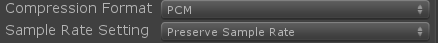
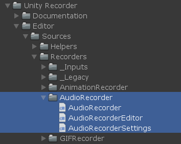
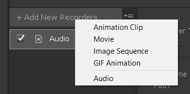
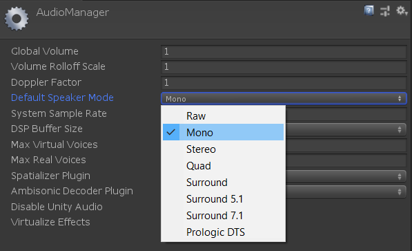

Audio Recorder
=================

A rudimentary proof-of-concept AudioRecorder running on top of our Recorder package. 
It only encodes WAV files and has no options except for the standard file output variables.

Hacked together by Jerome Maurey-Delaunay.   
WAV Encoder provided by Dominique Leroux.

[Unity package download.](bin/AudioRecorder.unitypackage)

How to Use
----------------------

* Create a new project
* Import the audio files you'd like to test.
* Make sure their import settings are set to PCM and Preserve Sample Rate (to preserve original quality).

* Create a Timeline audio edit as you normally do.
* Import the Unity Recorder package from the Asset Store.
* Import the AudioRecorder Package.   

* Add an Audio recorder in the Recorder window.   

* Press Start Recording to begin capturing the audio to file.

Good to know
----------------------
* Audio Recorder package takes into account the Audio Manager Settings for Default Speaker Mode. If set to Mono, the recorder will use a single channel to export the audio.   

* This does not encode based on an individual clip's channel count, but capturing the player's global output using the settings in the Audio Manager.

Future
----------------------
This work will be properly integrated in Recorder at some point.
