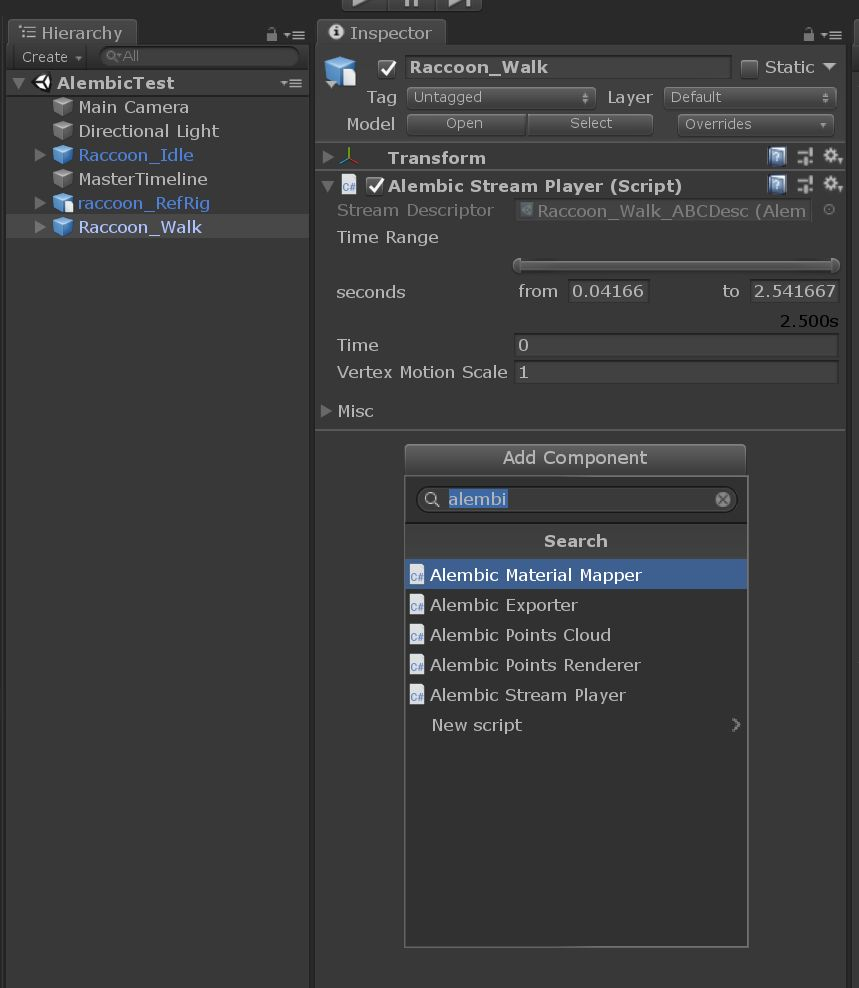
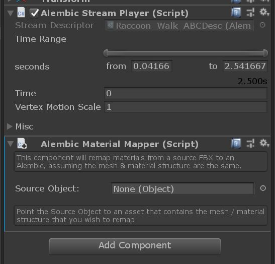
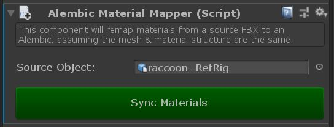

# Alembic Material Mapper

One of the major downsides to using Alembic is the lack of material support in the format. In Unity, each alembic's materials must be managed independently in the scene that they alembic is being accessed, which makes iteration times very slow and painful.

The Alembic Material Mapper component attempts to provide an easy solution for this problem, by using a target game object (an fbx for example) as the 'lookdev' material source for all materials. 

# To Use
Simply add an 'Alembic Material Mapper' component to the GameObject that has the Alembic Stream Player (ie the root object), and point the 'source object' to an fbx with the materials that match the alembic file.

1) Add Alembic Material Mapper

2) Add Source Object reference

3) 'Sync Materials' to apply the changes

*Note: the mesh names in the FBX file MUST match those in the Alembic 1-1 for the mapping to work properly. The easiest way to do this is to publish an FBX file at the same time you publish your Alembic animation. The FBX can be managed in Unity to unpack and create the materials, and then applied to all of the alembic animations for that particular asset.*

