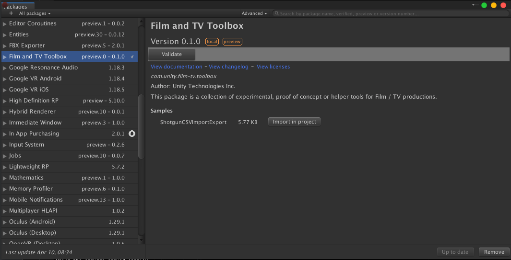
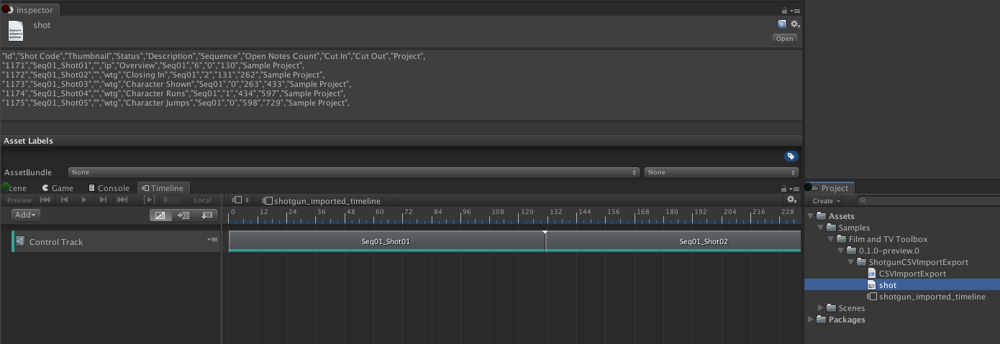

Unity Film / TV toolbox
=========================

This repository is a collection of experimental, proof of concept or helper tools for Film / TV productions.
 
Tools
=========================

Material Remapper
----------------------
Material Remapper allows to more easily assign material to models containing a lot of meshes (Alembic, etc).
It works with Legacy as well as SRP pipelines.

The tool was coded in large part by Mike Wutherick.

### How to Use

* Open the Material Remapper Window via `Window->Film-TV toolbox->Material Remapper`
* Select the root GameObject containing the MeshRenderers you want to set-up
* Click on "Update Scene Selection". This will load the list of unique MeshRenderers: 
* Add more materials to the session library by clicking "Add new Material Entry". Each new entry is initialized to the default current pipeline material.
* Replace the default materials with the wanted materials.
* Chose material assignments from the popup (Multiple materials per MeshRenderer are supported). 
* Once all assignments are configured, commit the changes to the Scene pressing "Apply Material Changes".
* If at any moment you wish to return to the default state of the Material Remapper, press ResetRemapper.

Samples
==========================

Since 2019.1, samples can be imported via the Package Manager window (Window > Package Manager) :

If you are using a previous version, download the sample on [film-tv-toolbox repository](https://github.com/Unity-Technologies/film-tv-toolbox).

Shotgun CSV Import Export
--------------------------

This sample shows how to create a timeline in Unity using a shot sequence from a Shotgun CSV export and export back modifications.

### How to install

* Import the sample via Package Manager UI
* This will import in your Assets folder :
    * CSVImportExport.cs : a sample script demonstrating how to simply import / export a Shotgun CSV file
    * shot.csv : a shotgun csv export sample, used in the import.

### How to test

* Go to `Window > Film-TV toolbox > Samples > Shotgun` and select `Import CSV`
    * This creates a Timeline Asset (see shotgun_imported_timeline in the sample folder) from the `shot.csv` sample file :
    

* Make edits to the Timeline asset

* Go to `Window > Film-TV toolbox > Samples > Shotgun` and select `Export CSV`:
    * See export_from_unity.csv in the sample folder

### Limitations

* Having commas in fields (e.g.: `Opening sequence, part 2`) will confuse the parser
* Having duplicate column names will cause errors due to duplicate keys
