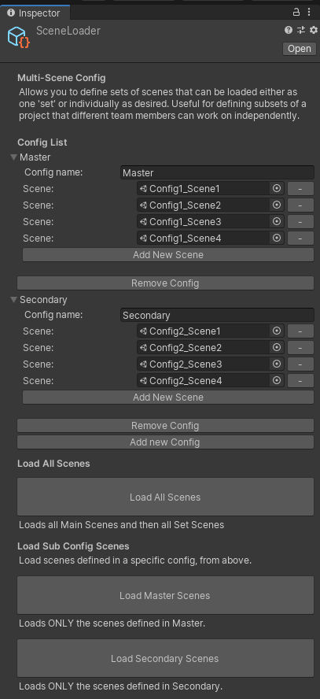

# Multi-Scene Loader

Adds a new multi-scene loading system for Edit or Runtime use cases. Unity provides the ability to work with multiple additively loaded scenes at a single time, however there is no 'out of the box' system for handling the loading / unloading of the various scene configurations. This makes working on a multi-user project more complicated than necessary, and most teams end up implementing something similar.

# Setup
Initially developed for working on Film / Animation projects (like Adam Ep 2 / 3 and Baymax Dreams), we needed a mechanism for team collaboration, having different users working on different areas of a larger project at a single time.

Since this time, the multi-scene loading system has rewritten to be more flexible and provide both Edit and Runtime tools for managing multi-scene configurations.

## Creating a new Multi-Scene Config

Creating new Multi-Scene configurations is very easy. 
### Project Window
Simply right click in the Project window and choose "Create->Scene Management->Multi Scene Loader"
### Asset Menu
From the Main menu in the Editor, choose "Assets->Create->Scene Management->Multi Scene Loader"

You can have any number of Multi-Scene Loaders in a project, and use them to load / unload different scenarios as needed.

## Configuration
This will create a new Multi-Scene Loader object in the project. 
Select the new Multi Scene Loader to configure.

In the new Multi-Scene Loader there is a list of Configs. Add a new Config to begin.

Each config defines a list of scenes to load.  

Choose 'Add New Scene' to add an entry to the list of scenes, or click the [ - ] button to remove an existing scene from a config.

Some ways that we have used this in the past is to separate individual sets or locations from each other. 

You might have a master config that contains the master Timeline or Gameplay scenes, and then an additional config that contains scenes for a single location, and another config for a second location, etc.

The system is designed to allow for a wide range of scene loading schema, for example:

> **Config 1** 
> - game menu
> - master gameplay scene
> 
> **Config 2**
> - location 1 environment
> - location 1 lighting
> - location 1 vfx
> 
> **Config 3**
> - location 2 environment
> - location 2 lighting
> - location 2 vfx

# Editor Use
The first way to use the Multi-Scene loader is from the editor. Once you have created and configured a Multi-Scene Loader (see above), you can either use the 'Load All Scenes' button to load the entire list of scenes in all of the available configs, OR load any of the individual configs using the individual loader buttons on the Inspector.

# Runtime Use
Multi-Scene Loader also provides a simple API that mirrors the UI buttons for loading the configurations.
See the 'Samples' folder for an example of how to use. 

Note: All scenes that are loaded at Runtime must be added to your project's Build Settings, same as normal. See this page in the manual for information:

https://docs.unity3d.com/Manual/BuildSettings.html

## Runtime API

    LoadAllScenes();	// Load all of the scenes in all of the configs	
    LoadSceneConfig(SceneConfig thisConfig, bool unloadOthers);		// load a specific config, and specify whether you want to replace / unload all of the existing scenes or load them additively

## Example Runtime Loading
    public class TestLoader()
    {
	    public MultiSceneLoader sceneConfig;
	    public void Start()
	    {
		    // load all of the scenes from all of the configs
	        sceneConfig.LoadAllScenes();
	        foreach( var thisConfig in sceneConfig.config)
	        {
		        // pass in the specific config that you would like to load
		        sceneConfig.LoadSceneConfig(thisConfig, true);
	        }
        }
    }
